# Guess The Lyrics Quiz!

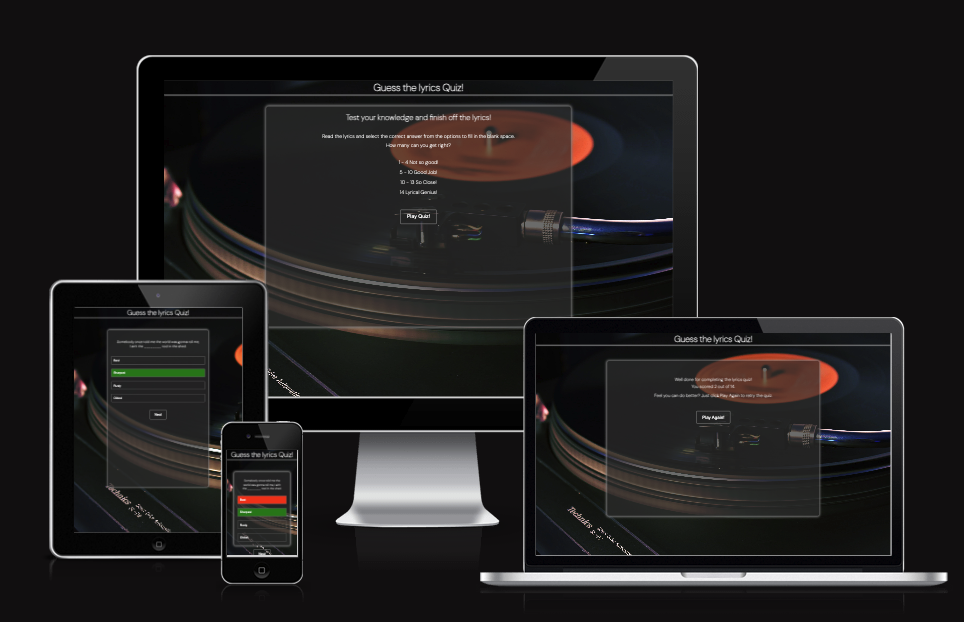

## About the page

Test your lyrical knowledge and see if you can match the words to the right songyrics in this engaging and entertaining online quiz.

Guess The Lyrics Quiz is an online, interactive quiz. Users will be able to asnwer a selection of multiple choice questions. Each quesiton will diplay with a missing word The user is then able to choose from a selection of 4 answers to fill in the blank. All questions are lyrics from popular songs so the quiz xan be played by an audience of all ages. 

The Guess the Lyrics Quiz is built using HTML, CSS and JavaScript. This quiz is a responsive website and can be view and played on mobiles, tablets and laptops/computers.This is my second project for Code Institute's Full Stack Developer Diploma course.

The live link can be found here - [Guess The Lyrics Quiz](https://philtipping31.github.io/PP2---GuessTheLyrics/)

# Features

## Home Page

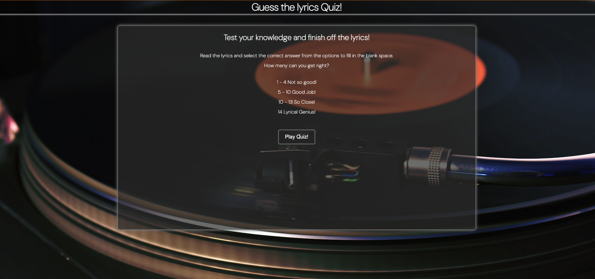

### Heading

 

### Info on how to play

### Play Button

. 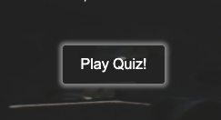

## Quiz Page 

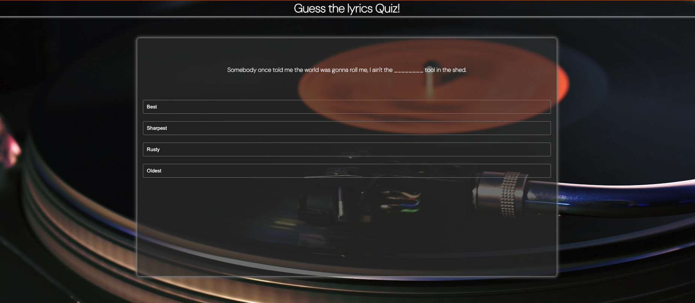

### The Question

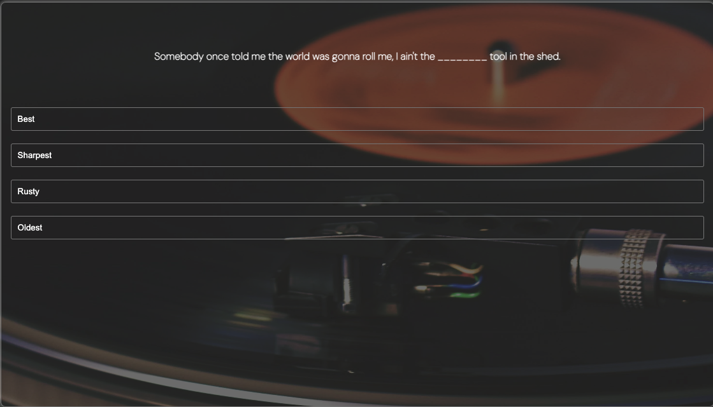

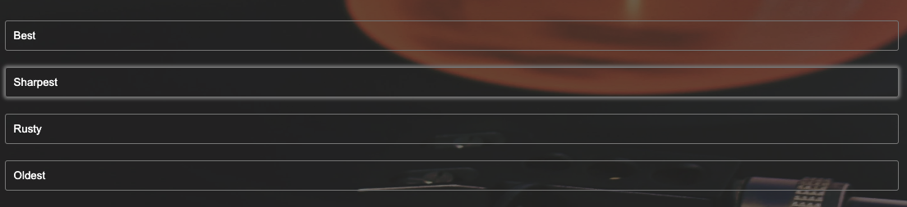

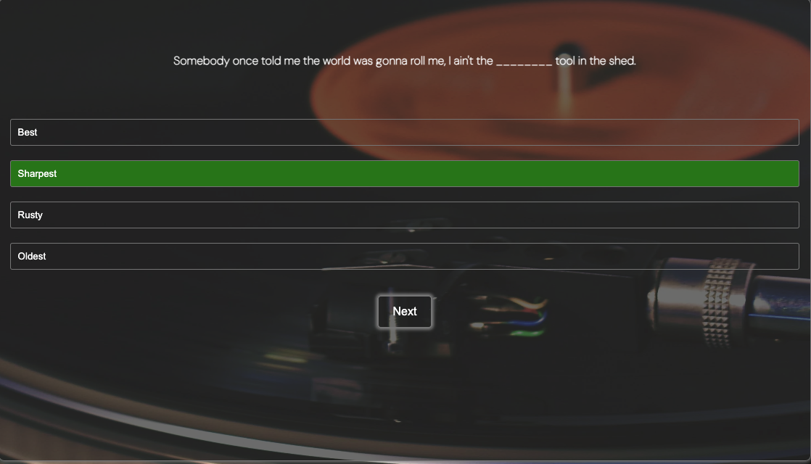

### The Answers

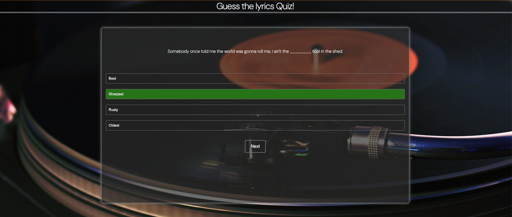

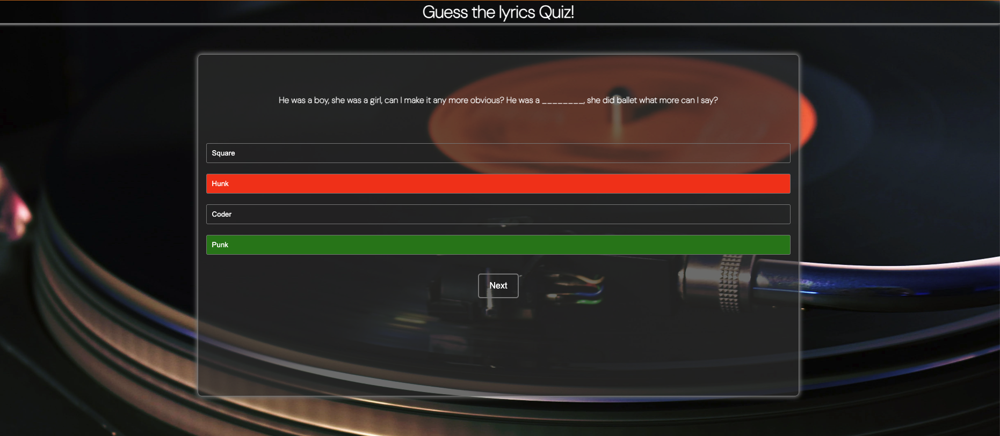

## Scores Page

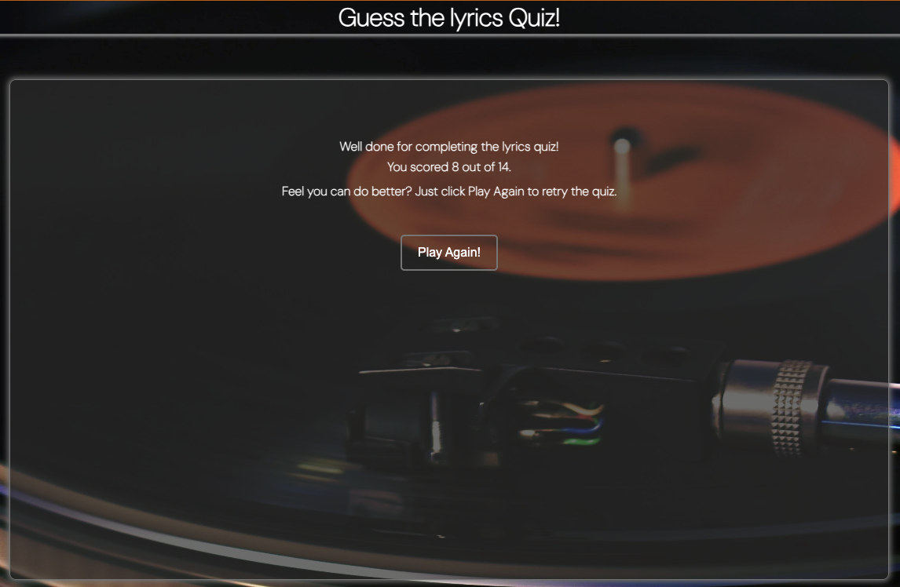

### End of Quiz

### Scores 

### Play Again

![Play Again Button]
![Play Again hover]

## Responsive Design

### Mobile View

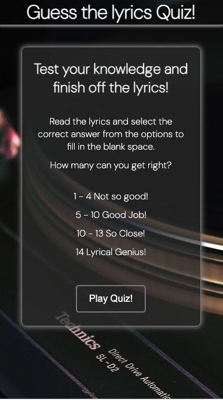

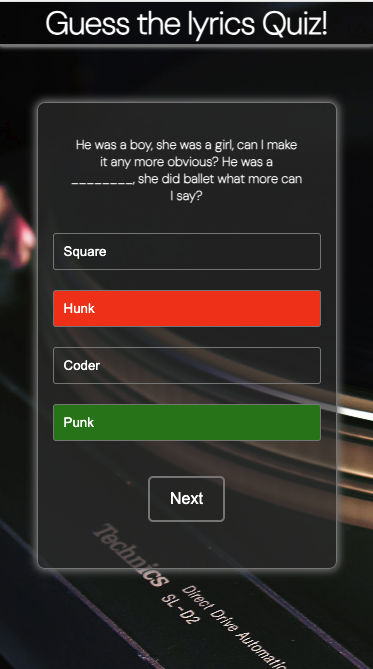

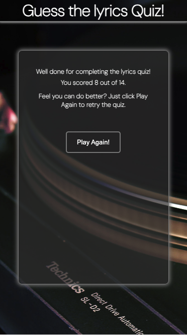

## Features left to implement

- Timer feature so users can test their knowledge against the clock.
- Add a Login page so a user can create an account and link with a leaderboard to see how they do against other players.
- Add more questions and different difficulty settings.

## User Experience (UX) and Design

## Testing

### General

### Header 

### Home Page

### Quiz Page

### Buttons

### Reponsiveness

### Validator Testing

- HTML
  - Checked all pages through the official [W3C validator] - I had issues with trailing slashes which CodeAnywhere seemed to add when saving and auto formatting. This was the same for my PP1. No other errors were shown other than a warning for no text in a <h3> element for the lyrics. I added the text "loading lyrics" for slower servers that are waiting for the javascript to load in.
- CSS
  - No errors were found when passing through the official [W3C CSS Validation Service]
- JavaScript
  - 
- Lighthouse
  - I ran my project through lighthouse to ensure the accessibility level was to a high standard on all pages.
  - The performance was in the middle region so I moved the Google Fonts link from the html document to the css document. I also changed the background image from jpg to webp.
  - 

![Lighthouse reading]

## Deployment

- The site was deployed to GitHub pages during the creation of the site. During the learning time deploying the project earlier was advised. The steps to deploy are as follows:

- Go to GitHub repository.
- Click on "Settings".
- Click on "Pages"(tab found on the left sidebar).
- Scroll to "Build and deployment" section.
- Find the sub-section "Branch".
- From the drop-down menu "none"/"select branch" change this to choose source "main" (or "master").
- Click 'Save'

Wait until you can see a link for deployed page within GitHub Page section. This can take a while. Once the page updates you will see a message: Your site is live at...

The live link can be found here - 

## Credits

- Other students and community leaders on Slack
- Elements of the Love maths projecet from code institute.
- Daisy, my mentor for helping me out with issues, particularly with background colour changes when selecting the wrong answer. And just overal support with the course and project.
- Stack Overflow
- https://www.online-convert.com/result#j=da9e1849-dd3f-4e39-be93-86f649a506d5 to change background image from jpg to webp

### Content

- The background image was taken from [Pexels](https://www.pexels.com/search/)
- Instructions on how to fix certain HTML and CSS elements were from [W3schools](https://www.w3schools.com)
- Google fonts were used for all text in the webpage.
- Some of the quiz content for lyrics and answers were taken from a a variety of other lyric quiz websites. (https://www.funtrivia.com/trivia-quiz/Music/Finish-the-Lyrics-233200.html) (https://triviacreator.com/quiz/tbeRToU) 

## Youtube Tutorials

Code structure, assistance, ideas and logic for JavaScript was taken from a combination of these videos.

- <https://www.youtube.com/watch?v=riDzcEQbX6k&t=2s&ab_channel=WebDevSimplified>
- <https://www.youtube.com/watch?v=PBcqGxrr9g8&ab_channel=GreatStack>
- <https://www.youtube.com/watch?v=WiLTsxjCmWQ&t=591s&ab_channel=DearProgrammer>
- <https://www.youtube.com/watch?v=Vp8x8-reqZA&ab_channel=Codehal>

