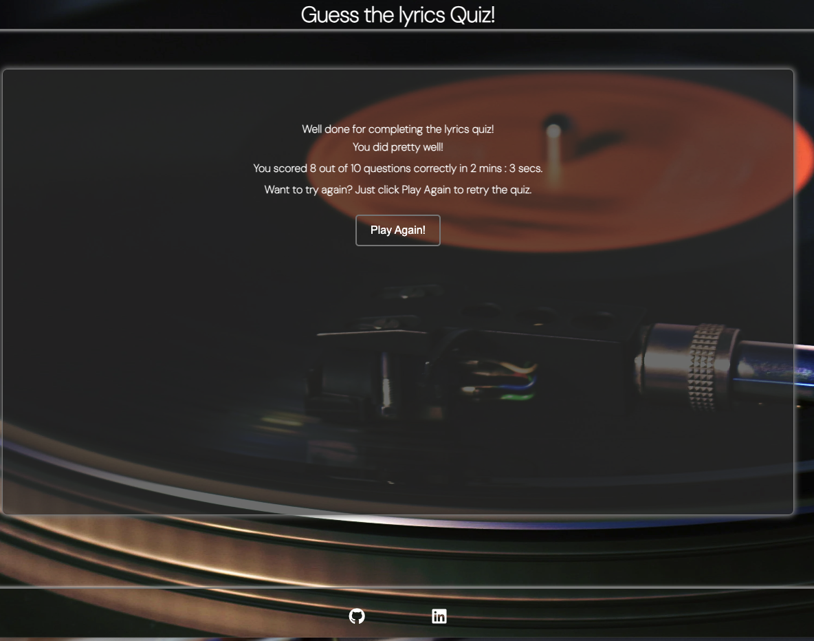

# Guess The Lyrics Quiz!

# About the page

Test your lyrical knowledge and see if you can match the words to the right song lyrics in this engaging and entertaining online quiz.

Guess The Lyrics Quiz is an online, interactive quiz. Users will be able to answer a selection of multiple choice questions. Each quesiton will display with a missing word. The user is then able to choose from 4 answers to fill in the blank. All questions are lyrics from popular songs allowing the quiz to be played by all ages. 

The Guess the Lyrics Quiz is built using HTML, CSS and JavaScript. This quiz is a responsive website and can be viewed and played on mobiles, tablets and computers. This is my second project for Code Institute's Full Stack Developer Diploma course.

The live link can be found here - [Guess The Lyrics Quiz](https://philtipping31.github.io/PP2---GuessTheLyrics/)

# User Experience

### First time user visit

- As a first time user, I want to clearly see what the aim of the quiz is and what it is about.
- As a first time user, I want to be able to choose when the quiz begins.
- As a first time user, I want to be able to see what answers I guess correctly and incorrectly.
- As a first time user, I want to know how many answers I guessed correctly in the form of a score.
- As a first time user, I want to be able to easily play the quiz again and as many times as I want.

### Returning User

- As a returning user, I want to be able to improve my score.

# Features

## Home Page

- The home page shows the background of a record player. This is consistent within all pages of the website allowing good user experience and continuity. 
- Users can easily see the title of the page on all pages via the header.
- A brief description is shown on what the quiz is about and how to play.
- A score breakdown is also shown so users can see what bracket they are aiming for before playing the quiz.
- The Info area is a transparent colour so the background image can still be seen in full, but without the issue of bad colour contrast. This is to ensure the user can see all written content clearly.

### Play Button

- The Play Quiz button is also shown on the home page. The button has a hover affect allowing the user to know that the button can be interacted with.
- When the Play Quiz button is clicked it will take the user to the quiz.html page and they can begin answering the questions.

. 

### Favicon

- I used a favicon from [Icons8](https://icons8.com/icons/set/favicon) - Its main purpose is to help visitors locate your page easier when they have multiple tabs open.

### Heading

 

- The header has been made simple and at a size that is not too obtrusive. This is so the user is naturally directed to the game area.
- The header also features a link to the home page so a user can navigate from playing the quiz back to the home page at any time if they wish.

## Quiz Page 

- The main quiz page is simple yet visually pleasing. The background image is the same as the home page as well as the quiz area being the same style as the main info page. 
- The header is still visible, allowing a user to go back to the home page at anytime during the quiz.

### The Question and Answers

- Initially the first question (lyrics) will display with 4 options for the user to choose from to complete the lyrics.

  
- The answer buttons all have the same hover affect as other buttons on the site, showing the user they can interact with them.

- Once an answer has been selected the answer selected will either highlight 'green' for correct or 'red' for incorrect.
- If an incorrect answer is selected the correct answer will be highlighted in green so the user can see the option they should have picked to get the answer correct.

- After an answer has been selected, all other options will be disabled. This is to stop the user being able to select a different answer after their first guess.
- After an answer has been selected, the 'Next' button will appear, allowing the user to click and navigate to the next question.

## Scores Page

### End of Quiz

- The scores page is in place to show the user they have completed the quiz.
- The user will be able to see how many answers they answered correctly and out of how many questions that are in the quiz.
- There is an option for the user to click "Play Again". This reloads the page and resets the scores allowing the user to play the quiz again to see if they can beat their last score.

## Responsive Design

- The Guess the lyrics quiz is made with a responsive design ensuring users can play properly and view all pages on all screen sizes. 
- I began the design on mobile sizing first and worked my way up to larger screens.

### Mobile View

## Features left to implement

- Timer feature so users can test their knowledge against the clock.
- Add a Login page so a user can create an account and link with a leaderboard to see how they do against other players.
- Add more questions and different difficulty settings.

# Testing

### General

- The web page was constantly tested through Chrome Dev Tools for errors and responsiveness.
- I tested the page on other browsers as well as Chrome:
  - Safari
  - Microsoft Edge
  - Firefox
  - Internet Explorer

- Tested the header link on all pages to ensure it always takes the user to the home page of the quiz.

### Home Page

- Buttons work correctly and direct the user to the intended page.
- All text is visible to the user.

### Quiz Page

- Questions display in order correctly.
- All answers can be interacted with after question is displayed.
- Correct and Incorrect answers are highlighted correctly when selected.
- After one answer is selected, all other answer options are disbaled and Next button shows.
- Next button resets question to a new one and resets answer and hides next button.

### Scores Page

- Score tallys correctly. Tested all variables of correct and incorrect options answered. Correct score always shows out of the correct number of questions.
- Play Again button correctly resets the quiz by reloading the page to start again.

### Reponsiveness

- The webpage has been tested in Chrome Dev Tools to allow me to test the site on different screen sizes.
- Viewed web page on iPhone 13 pro and Ipads outside of Chrome Dev Tools to ensure the same results were showing.
- All media queries work correclty for the desired screen size.

### Validator Testing

- HTML
  - Checked all pages through the official [W3C validator](https://validator.w3.org/nu/#textarea) - I had issues with trailing slashes which CodeAnywhere seemed to add when saving and auto formatting. This was the same for my PP1. No other errors were shown other than a warning for no text in a 'h3' element for the lyrics. I added the text "loading lyrics" for slower servers that are waiting for the javascript to load in.

- CSS
  - No errors were found when passing through the official [W3C CSS Validation Service](https://jigsaw.w3.org/css-validator/validator)

(docs/css-validator.png)

- JavaScript
  - I ran my Javascript code through [JSHint](https://jshint.com/) - no warnings show. 

- Lighthouse
  - I ran my project through lighthouse to ensure the accessibility level was to a high standard on all pages.
  - The performance was in the middle region so I moved the Google Fonts link from the html document to the css document. I also changed the background image from jpg to webp. This improved the score to 100 on all pages.

- Home Page
  

- Quiz Page

## Deployment

### Deployment to Github Pages

  The site was deployed to GitHub pages during the creation of the site. During the learning time deploying the project earlier was advised. The steps to deploy are as follows:

  - Go to GitHub repository.
  - Click on "Settings".
  - Click on "Pages"(tab found on the left sidebar).
  - Scroll to "Build and deployment" section.
  - Find the sub-section "Branch".
  - From the drop-down menu "none"/"select branch" change this to choose source "main" (or "master").
  - Click 'Save'

Wait until you can see a link for deployed page within GitHub Page section. This can sometimes take a bit of time. Once the page updates you will see a message: "Your site is live at...

The live link can be found here - [Guess The Lyrics Quiz](https://philtipping31.github.io/PP2---GuessTheLyrics/)

### Version Control

The site was created using the CodeAnywhere code editor and pushed to github to the remote repository ‘Guess-the-lyrics-quiz’.

The following git commands were used throughout development to push code to the remote repo:

- git add . - This command was used to add the file(s) to the staging area before they are committed.

- git commit -m “commit message” - This command was used to commit changes to the local repository queue ready for the final step.

- git push - This command was used to push all committed code to the repository on github.

### Cloning

Navigate to the GitHub and locate the Repository you want to clone to use locally:

- Click on the code drop down button
- Click on HTTPS option
- Click on the Copy option to copy the repository link
- Open your IDE of choice (git must be installed for the next steps)
- Type git clone copied-git-url into the IDE terminal
- The project will now be cloned on your local machine for use.
 

## Credits

- Other students and community leaders on Slack
- Elements of the Love maths projecet from code institute.
- My mentor for helping me out with issues, particularly with background colour changes when selecting the wrong answer. And just overal support with the course and project.
- Stack Overflow for lots of help on areas I got stuck on.
- I used [Online Convert](https://www.online-convert.com/result#j=da9e1849-dd3f-4e39-be93-86f649a506d5) to change background image from jpg to webp.

### Content

- The background image was taken from [Pexels](https://www.pexels.com/search/)
- Instructions on how to fix certain HTML and CSS elements were from [W3schools](https://www.w3schools.com)
- JavaScript help was taken from [W3schools](https://www.w3chools.com)
- Google fonts were used for all text on the webpage.
- Some of the quiz content for lyrics and answers were taken from a a variety of other lyric quiz websites as well as my own ideas. (https://www.funtrivia.com/trivia-quiz/Music/Finish-the-Lyrics-233200.html) (https://triviacreator.com/quiz/tbeRToU) 

## Youtube Tutorials

Code structure, assistance, ideas and logic for JavaScript have been taken from a combination of these videos.

- <https://www.youtube.com/watch?v=riDzcEQbX6k&t=2s&ab_channel=WebDevSimplified>
- <https://www.youtube.com/watch?v=PBcqGxrr9g8&ab_channel=GreatStack>
- <https://www.youtube.com/watch?v=WiLTsxjCmWQ&t=591s&ab_channel=DearProgrammer>
- <https://www.youtube.com/watch?v=Vp8x8-reqZA&ab_channel=Codehal>

