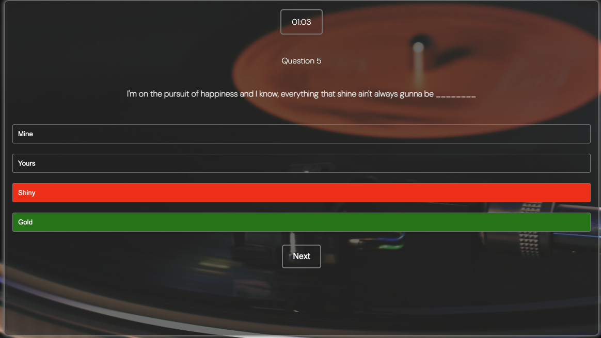
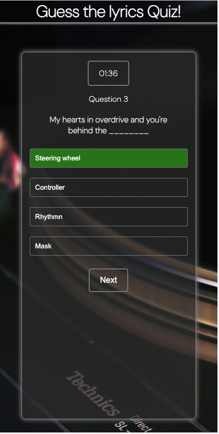

# Guess The Lyrics Quiz!

# About the page

Test your lyrical knowledge and see if you can match the words to the right song lyrics in this engaging and entertaining online quiz.

Guess The Lyrics Quiz is an online, interactive quiz. Users will be able to answer a selection of multiple choice questions. Each question will display with a missing word. The user is then able to choose from 4 answers to fill in the blank. The user will be able to test their knowldge against the clock with the timer that is visible during the quiz. When the quizends the user will be able to see how manu the guessed right and within what time. All questions are lyrics from popular songs allowing the quiz to be played by all ages. 

The Guess the Lyrics Quiz is built using HTML, CSS and JavaScript. This quiz is a responsive website and can be viewed and played on mobiles, tablets and computers. This is my second project for Code Institute's Full Stack Developer Diploma course.

The live link can be found here - [Guess The Lyrics Quiz](https://philtipping31.github.io/PP2---GuessTheLyrics/)

# User Experience

### First time user visit

- As a first time user, I want to clearly see what the aim of the quiz is and what it is about.
- As a first time user, I want to be able to choose when the quiz begins.
- As a first time user, I want to be able to see what answers I guess correctly and incorrectly.
- As a first time user, I want to know how many answers I guessed correctly in the form of a score.
- As a first time user, I want to see how quickly I answered all of the questions.
- As a first time user, I want to be able to easily play the quiz again and as many times as I want.

### Returning User

- As a returning user, I want to be able to improve my score.

# Features

## Home Page

- The home page shows the background of a record player. This is consistent within all pages of the website allowing good user experience and continuity. 
- Users can easily see the title of the page on all pages via the header.
- A brief description is shown on what the quiz is about and how to play.
- A score breakdown is also shown so users can see what bracket they are aiming for before playing the quiz.
- The Info area is a transparent colour so the background image can still be seen in full, but without the issue of bad colour contrast. This is to ensure the user can see all written content clearly.

### Play Button

- The Play Quiz button is also shown on the home page. The button has a hover effect allowing the user to know that the button can be interacted with.
- When the Play Quiz button is clicked it will take the user to the quiz.html page and they can begin answering the questions.

. 

### Favicon

- I used a favicon from [Icons8](https://icons8.com/icons/set/favicon) - Its main purpose is to help visitors locate the web page easier when they have multiple tabs open.

### Heading

 

- The header has been made simple and at a size that is not too obtrusive. This is so the user is naturally directed to the game area.
- The header also features a link to the home page so a user can navigate from playing the quiz back to the home page at any time if they wish.

## Quiz Page 

- The main quiz page is simple yet visually pleasing. The background image is the same as the home page as well as the quiz area being the same style as the main info page. 
- The header is still visible, allowing a user to go back to the home page at any time during the quiz.
- Question is displayed along with the answers.
- Timer is shown at the top of the quiz container and increments in seconds as the user stays playing the quiz.
- The question number is shown and will increase by one for each question.

### The Question and Answers

- Initially the first question (lyrics) will display with 4 options for the user to choose from to complete the lyrics.

  
- The answer buttons all have the same hover effect as other buttons on the site, showing the user they can interact with them.

- Once an answer has been selected the answer selected will either highlight 'green' for correct or 'red' for incorrect.
- If an incorrect answer is selected the correct answer will be highlighted in green so the user can see the option they should have picked to get the answer correct.
- After an answer has been selected, all other options will be disabled. This is to stop the user being able to select a different answer after their first guess.
- After an answer has been selected, the 'Next' button will appear, allowing the user to click and navigate to the next question.

## Timer

- The timer is shown during the quiz and increments by 1 second at a time. This only increments as the user is playing the quiz.
  

  
- When the quiz finishes it will tell the user how quickly they answered all of the questions.

## Scores Page

- The scores page is in place to show the user they have completed the quiz.
- The user will be able to see how many answers they answered correctly and out of how many questions that are in the quiz.
- The user will get a different message based on how many questions they answered correctly.
- The time in which the user took to answer the questions will also show on this page.
- There is an option for the user to click "Play Again". This reloads the page and resets the scores allowing the user to play the quiz again to see if they can beat their last score.

## 404 Page 

- The 404 page will display if a user navigates to a broken link or adds additional text to the existing URL.
- The 404 page will allow the user to easily navigate back to the main website if they do encounter a broken link / missing page without having to click the back button on the browser.

## Responsive Design

- The Guess the lyrics quiz is made with a responsive design ensuring users can play properly and view all pages on all screen sizes. 
- I began the design on mobile sizing first and worked my way up to larger screens.

### Mobile View

## Features left to implement

- Add a Login page so a user can create an account and link with a leaderboard to see how they do against other players.
- Add different difficulty settings.
- User customisation to choose how many questions they want to get asked.
- Time limit on how long a question displays.
- Leaderboard

# Testing

### General

- The web page was constantly tested through Chrome Dev Tools for errors and responsiveness.

- I tested the page on other browsers as well as Chrome by opening the live link in each of the following browsers:
  - Safari
  - Microsoft Edge
  - Firefox
  - Internet Explorer

All browsers show the page correctly and as intended.

### Header

| Test                                                       | Action                                      | Expected                          | Result |
| ---------------------------------------------------------- | ------------------------------------------- | --------------------------------- | ------ |
| Checked header link directs user to home page on all pages | Click on the header "Guess the Lyrics Quiz" | Takes user to the index.html page | Pass   |

### Home Page

| Test                                                                                    | Action                                                                         | Expected                                              | Result |
| --------------------------------------------------------------------------------------- | ------------------------------------------------------------------------------ | ----------------------------------------------------- | ------ |
| Does the Play Quiz button correctly load the quiz                                       | Click Play Quiz button                                                         | Loads the quiz.html page to begin the quiz            | Pass   |
| Is the text on the home page clear to the user                                          | Check all text is clearly visible against the background                       | User can clearly see all text on the home page        | Pass   |
| If background image doesn't load is the backup background suitable for the text colour | Removed background image and checked if the text is still visible to the user. | User can still clearly read all text on the home page | Pass   |

### Quiz Page

| Test                                                                                               | Action                                                                                                                                                                                                                                         | Expected                                                                                                                      | Result |
| -------------------------------------------------------------------------------------------------- | ---------------------------------------------------------------------------------------------------------------------------------------------------------------------------------------------------------------------------------------------- | ----------------------------------------------------------------------------------------------------------------------------- | ------ |
| Does a total of 10 questions display. After the 10th question, scores page is shown.               | Run through the quiz multiple times and check that 10 questions display before the quiz ends.                                                                                                                                                  | 10 questions are shown at random from the js file. After the 10th question the scores are shown.                              | Pass   |
| Can the user choose from all 4 answers when the question is displayed                              | Load each question and check each answer is clickable. Repeat process for all 10 questions                                                                                                                                                     | The user can select from one of the 4 options each time a question is displayed. All options begin clickable.                 | Pass   |
| When an answer is selected, does the correct answer and incorrect answer highlight correctly.      | Select a correct answer to see if it highlights correctly. Select an incorrect answer and see if it highlights correctly as well as showing the user the correct answer.                                                                       | Correct answers show in green and incorrect answers show in red as well as show the user the correct answer in green.         | Pass   |
| Once an answer is selected are all other answers disabled so the user can no longer click on them? | Select an answer and attempt to select another one.                                                                                                                                                                                            | Once answer is selected, the user can no longer select another option                                                         | Pass   |
| When an answer is selected, does the next button appear                                            | Select an answer and see the next button appear to go to the next question                                                                                                                                                                     | The Next button appears correctly after an answer is selected                                                                 | Pass   |
| Does clicking the next button load a new question and answers                                      | Click Next and see if the next question shows with the answer options linked to it.                                                                                                                                                            | After clicking next, the next question in the index is loaded with all of the answer options linked to that specific question | Pass   |
| Does the timer show and increment during the quiz                                                  | Play the quiz, and check that the timer displays. Also wait until 59 seconds are up to check the timer then goes to minutes and then increments the seconds again, When it gets to the next 59 seconds, ensure that the minute is incremented. | Timer shows and counts correctly.                                                                                             | Pass   |
| Does the question number appear i.e Question 1 and then increment for each question correctly.     | Run through the quiz and ensure the question number correct goes through from 1 - 10                                                                                                                                                           | Question number shows correctly throughout and increments correctly.                                                          | Pass   |                                                                                           | Pass |

### Scores Page

| Test                                                                                                                        | Action                                                                                                                                                                                                                                   | Expected                                                                                                               | Result |
| --------------------------------------------------------------------------------------------------------------------------- | ---------------------------------------------------------------------------------------------------------------------------------------------------------------------------------------------------------------------------------------- | ---------------------------------------------------------------------------------------------------------------------- | ------ |
| Does the score tally up correctly based on options selected and correct text displays based on the total of correct answers | Run through the quiz and choose all correct answers / all incorrect answers / then go through and answer 1 additional correct answer each time to see that the scores tally correctly as the end of the quiz and show the relevant text. | Do the scores show correctly based on what the user has selected throughout the quiz.                                  | Pass   |
| Does the Play Again button correctly reset the scores and reload the quiz                                                   | Click the Play Again button                                                                                                                                                                                                              | The play again button reloads the quiz, taking the user back to the first question and also resets the previous score. | Pass   |
| Does the time show correctly based on how long the user took to complete the quiz.                                          | Check the timer at the end of the quiz and make sure that the same time is shown on the scores page                                                                                                                                      | Correct time is shown on scores page                                                                                   | Pass   |

### 404 Error Page

| Test                                                             | Action                                                                        | Expected                                                   | Result |
| ---------------------------------------------------------------- | ----------------------------------------------------------------------------- | ---------------------------------------------------------- | ------ |
| Do all text and images show correctly and respond to screen size | Check webpage on dev tools for responsiveness and contrast on text/background | Image and text all display as intended on all screen sizes | Pass   |
| Does the page appear when broken URL is entered                  | Enter additional text to live URL and check if the 404 Error page displays    | 404 Error page displays when broken URL entered            | Pass   |
| Does the 'HERE' text direct the user back to website home page   | Click on there here text to see if the site is directed back to the home page | On clicking the here text, the home page reloads           | Pass   |

### Responsiveness

| Test                                                      | Action                                                                                                     | Expected                                                                                                          | Result |
| --------------------------------------------------------- | ---------------------------------------------------------------------------------------------------------- | ----------------------------------------------------------------------------------------------------------------- | ------ |
| Does the webpage show on different screen sizes correctly | Open Dev Tools on Chrome by clicking Inspect. Change the screen size by dragging or selecting device type. | Content on the screen is visible on all screen sizes/ no images are pixelated / all interactions work as intended | Pass   |
| Check webpage on an actual phone and tablet size screen   | Tested on personal iphone 13 pro and Ipad                                                                  | Webpage works as shown on dev tools with no issues                                                                | Pass   |
| Media queries working as intended                         | Review all media queries and check the changes when the screen size is increased/decreased                 | Sizing is correct when screen size is increased from phone to tablet and larger                                   | Pass   |

### Validator Testing

- HTML
  - Checked all pages through the official [W3C validator](https://validator.w3.org/nu/#textarea) - I had issues with trailing slashes which CodeAnywhere seemed to add when saving and auto formatting. This was the same for my PP1. No other errors were shown other than a warning for no text in a 'h3' element for the lyrics. I added the text "loading lyrics" for slower servers that are waiting for the javascript to load in.

- CSS
  - No errors were found when passing through the official [W3C CSS Validation Service](https://jigsaw.w3.org/css-validator/)

- JavaScript
  - I ran my Javascript code through [JSHint](https://jshint.com/) - no warnings show. 

- Lighthouse
  - I ran my project through lighthouse to ensure the accessibility level was to a high standard on all pages.
  - The performance was in the middle region so I moved the Google Fonts link from the html document to the css document. I also changed the background image from jpg to webp. This improved the score to 100 on all pages.

- Home Page
  

- Quiz Page

## Deployment

### Deployment to Github Pages

  The site was deployed to GitHub pages during the creation of the site. During the learning time deploying the project earlier was advised. The steps to deploy are as follows:

  - Go to the GitHub repository.
  - Click on "Settings".
  - Click on "Pages"(tab found on the left sidebar).
  - Scroll to the "Build and deployment" section.
  - Find the sub-section "Branch".
  - From the drop-down menu "none"/"select branch" change this to choose source "main" (or "master").
  - Click 'Save'

Wait until you can see a link for the deployed page within the GitHub Page section. This can sometimes take a bit of time. Once the page updates you will see a message: "Your site is live at...

The live link can be found here - [Guess The Lyrics Quiz](https://philtipping31.github.io/PP2---GuessTheLyrics/)

### Version Control

The site was initially created using the CodeAnywhere code editor and pushed to github to the remote repository ‘Guess-the-lyrics-quiz’. I finished off the code in GitPod due to issues with the CodeAnywhere IDE.

The following git commands were used throughout development to push code to the remote repo:

- git add . - This command was used to add the file(s) to the staging area before they are committed.

- git commit -m “commit message” - This command was used to commit changes to the local repository queue ready for the final step.

- git push - This command was used to push all committed code to the repository on github.

### Cloning

Navigate to the GitHub and locate the Repository you want to clone to use locally:

- Click on the code drop down button
- Click on HTTPS option
- Click on the Copy option to copy the repository link
- Open your IDE of choice (git must be installed for the next steps)
- Type git clone copied-git-url into the IDE terminal
- The project will now be cloned on your local machine for use.
 

## Credits

- Other students and community leaders on Slack
- Elements of the 'Love maths' project from code institute.
- My mentor, Daisy for helping me out with issues, particularly with background colour changes when selecting the wrong answer. And just overall support at the final stages of this project.
- I used [Online Convert](https://www.online-convert.com/result#j=da9e1849-dd3f-4e39-be93-86f649a506d5) to change background image from jpg to webp.
- [Table to MD](https://tabletomarkdown.com/convert-spreadsheet-to-markdown/) I used this converted to display my testing section.

### Content

- The background image was taken from [Pexels](https://www.pexels.com/photo/black-turntable-1653090/)
- Instructions on how to fix certain HTML and CSS elements were from [W3schools](https://www.w3schools.com)
- Google fonts were used for all text on the webpage.
- Some of the quiz content for lyrics and answers were taken from [Funtrivia](https://www.funtrivia.com/trivia-quiz/Music/Finish-the-Lyrics-233200.html) and [Trivir Creator](https://triviacreator.com/quiz/tbeRToU) as well as my own content.
- [Font Awesome](https://fontawesome.com/icons) was used to get the icon for the 404 Error Page and Footer.
- [mdn web docs](https://developer.mozilla.org/en-US/docs/Web/API/setInterval) I read through this document to help me understand the setInterval() function to help with the timer logic.
- [Stack Overflow](https://stackoverflow.com/questions/31559469/how-to-create-a-simple-javascript-timer) This page helped me understand how to code a timer in Javascript.
- Code Institute walkthroughs and learning material to help with syntax and other JavaScript features.

## Youtube Tutorials

I watched these videos to help with the logic on how to build a quiz game using JavaScript. 

- <https://www.youtube.com/watch?v=riDzcEQbX6k&t=2s&ab_channel=WebDevSimplified>
- <https://www.youtube.com/watch?v=WiLTsxjCmWQ&t=591s&ab_channel=DearProgrammer>
- <https://www.youtube.com/watch?v=Vp8x8-reqZA&ab_channel=Codehal>

This youtube video was followed closly and code was taken from this for the following functions:

- startQuiz function, however I have added the shufflequestions section and the call to start the timer function.
- showQuestion function, however I have written this differently to the video and split it into two functions to create a createAnswerButton function as well.
- resetState function to clear the current question ready to reload the next one.
- selectAnswer function, this was used but refactored and used in a slightly different way to assign the colours to the answer buttons without adding classes.
- nextbutton event listener code, changed to only factor in 10 questions.
- handleNextButton, however I changed the setup of this code to deal with 10 questions and use of const to define MaxQuestions.

